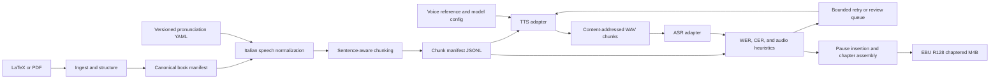

# Italian Audiobook Pipeline Architecture

This document is the source of truth for architecture, stable contracts, environment policy, model strategy, and normalization policy. Delivery order, verification stages, and checkpoint acceptance criteria live in [`implementation.md`](implementation.md); keeping those concerns there avoids duplicating milestone details in this document.

## Recommendation

Use a staged, artifact-based Python 3.11 CLI rather than a workflow server. A single 8-hour book is small enough for a local runner, while immutable manifests and content-addressed chunk files provide the important properties: resumability, auditability, selective regeneration, and safe model swaps.

Prefer LaTeX when available because it preserves chapter and paragraph semantics. Treat PDF as a fallback extraction path, not the canonical source format.

## Environment and dependency isolation

Use [Pixi](https://pixi.sh/) as the project environment manager. It can install and lock both Python/PyPI packages and native conda-forge tools such as `ffmpeg`, `pandoc`, and `libsndfile`, avoiding dependencies on system-wide installations. Commit `pixi.lock`, keep generated environments under `.pixi/`, and run every project command through `pixi run`.

Define separate, composable Pixi environments:

- `base`: ingestion, normalization, chunking, and assembly.
- `chatterbox`: the base project plus Chatterbox MLX/MPS dependencies.
- `kokoro`: the base project plus Kokoro MLX dependencies.
- `asr`: the base project plus MLX-Whisper dependencies.
- `default`: the base project plus test, linting, formatting, and type-checking tools.

Keeping inference backends separate reduces dependency conflicts. Synthesis and verification should also execute as separate processes so the TTS and ASR models are never resident in unified memory simultaneously.

Redirect Hugging Face, MLX, and other model caches into a configurable project workspace such as `work/cache/`. This keeps downloaded weights outside the operating-system Python environment and makes cache location and cleanup explicit. The only bootstrap prerequisite is the standalone Pixi executable, which can be installed in the user's home directory.

Docker is not the primary runtime on Apple Silicon because macOS containers do not receive direct Metal/MPS GPU passthrough. It may still be added later for CPU-only CI checks or Linux/CUDA deployment, while accelerated local TTS and ASR remain native processes managed by Pixi.

## Stable contracts

- `BookDocument`: chapters containing ordered blocks with source locations, paragraph boundaries, and untouched display text.
- `NormalizedBlock`: both `display_text` and `spoken_text`, plus an audit list of applied rules. Never overwrite the source text.
- `ChunkRecord`: stable chapter/paragraph/sentence IDs, pause metadata, spoken text, expected language, and a content hash.
- `GenerationRecord`: engine/model revision, voice/reference hash, inference parameters, seed, output checksum, duration, and retry number.
- `VerificationRecord`: transcript, WER, CER, alignment edits, duration/speaking-rate checks, pass/fail reasons, and review status.

Persistent manifests use explicit schema identifiers such as `book-document/v1` and reject unknown fields.
Canonical JSON is UTF-8 with sorted keys, compact separators, preserved Unicode, and non-finite numbers rejected.
Each stored artifact is wrapped in an `artifact-envelope/v1` record containing the payload checksum and exact upstream artifact references.
Artifact reads validate the envelope, payload checksum, requested contract, and current upstream checksums before returning data.
Artifact replacement uses a temporary file, file synchronization, and atomic rename within the owning `work/<book-id>/` workspace.

A chunk cache key hashes the spoken text, normalization version, lexicon checksum, model revision, voice identity and reference checksum, and synthesis settings.
Presentation metadata such as title, author, narrator, subtitle, and cover does not contribute to the synthesis cache key.
Merely skipping an existing filename is unsafe after a lexicon or model change.

## Components and proposed layout

- [`src/bilbo_tts/cli.py`](src/bilbo_tts/cli.py): commands `ingest`, `normalize`, `chunk`, `synthesize`, `verify`, `assemble`, and an idempotent `run` command.
- [`src/bilbo_tts/models.py`](src/bilbo_tts/models.py): Pydantic definitions for all manifests and sidecars.
- [`src/bilbo_tts/ingest/`](src/bilbo_tts/ingest/): Pandoc AST adapter for LaTeX; PyMuPDF4LLM adapter for born-digital PDF; reject or explicitly route scanned PDFs to OCR.
- [`src/bilbo_tts/normalization/`](src/bilbo_tts/normalization/): deterministic, ordered Italian rules for Unicode cleanup, dehyphenation, percentages, decimals, ratios, currencies, ordinals, symbols, abbreviations, and lexicon replacement using `num2words(lang="it")`.
- [`config/lexicons/finance-it.yaml`](config/lexicons/finance-it.yaml): versioned literal/regex entries with word boundaries, priority, optional case sensitivity, spoken replacement, and notes. Keep model-specific exceptions in a separate overlay.
- [`src/bilbo_tts/chunking.py`](src/bilbo_tts/chunking.py): paragraph-first, sentence-aware splitting with configurable character/phoneme limits; preserve `break_before` rather than inserting silence into generated clips.
- [`src/bilbo_tts/tts/`](src/bilbo_tts/tts/): a narrow engine interface plus Chatterbox and Kokoro adapters.
- [`src/bilbo_tts/asr/`](src/bilbo_tts/asr/): a narrow transcription interface with an MLX-Whisper implementation.
- [`src/bilbo_tts/verification.py`](src/bilbo_tts/verification.py): JiWER-based scoring, repetition/truncation and duration heuristics, bounded retries, and a machine-readable review queue.
- [`src/bilbo_tts/assembly.py`](src/bilbo_tts/assembly.py): concatenate lossless PCM with sentence/paragraph/chapter pauses, run two-pass `ffmpeg loudnorm`, create FFMETADATA chapter markers, and encode AAC only once into `.m4b`.
- [`books/<book-id>/book.yaml`](books/<book-id>/book.yaml): input, title/author, voice, engine, thresholds, pause durations, loudness target, and cover settings.
- `work/<book-id>/`: ignored derived manifests, chunk WAVs, transcripts, reports, and final media. Inputs and reusable configuration remain versioned.

## Model and runtime strategy for a 16 GB Apple Silicon Mac

- Quality candidate: Chatterbox Multilingual V3. It supports Italian and is MIT-licensed, but its Apple MLX/MPS variants use roughly 14–16 GB, so a 16 GB Mac is borderline and may swap. Keep it as the first quality trial, not a hard dependency.
- Lightweight baseline/fallback: Kokoro-82M through MLX, with Apache-2.0 weights. It is fast and small, but Italian voices have reported English-like G2P/prosody issues; do not select it solely from English demos.
- Before committing, run a fixed 20–30 excerpt bake-off containing Italian prose, percentages, ratios, currencies, abbreviations, English finance terms, long sentences, and dialogue. Record ASR metrics, generation speed, memory pressure, and blind listening preference. Store this corpus as a regression fixture.
- Verification on macOS should use MLX-Whisper or whisper.cpp, not `faster-whisper`: CTranslate2 has no MPS path and runs CPU-only on Apple Silicon. Start with `large-v3-turbo`; make the exact ASR model configurable.
- Preserve permissive licensing throughout so the same pipeline can later produce a commercial audiobook. For voice cloning, use only a voice the user owns or has explicit permission to reproduce.

## Normalization and verification policy

- Apply specific patterns before generic number expansion. For example, ratios, percentages, currency, dates, chapter references, and ranges must be disambiguated before calling `num2words`; `60/40` must not accidentally become a date or fraction.
- Keep normalization deterministic and covered by golden tests. The pronunciation YAML is reviewed data, not generated inference. An optional local model may suggest entries later, but should never silently rewrite book text.
- Compare ASR output to `spoken_text`, not the printed source. Normalize both sides consistently for casing, punctuation, apostrophes, and accent variants.
- Use WER as one signal, not the sole oracle: combine WER/CER with missing-prefix/suffix detection, repeated n-grams, abnormal duration, and speaking rate. Calibrate thresholds against the bake-off corpus, then retry at most a configured number of times before manual review.
- Assembly should consume only accepted chunks by default; an explicit override may include reviewed exceptions.

## Implementation and verification

See [`implementation.md`](implementation.md) for gated milestones C0–C8, automated and manual verification stages, and completion criteria. That document references the architectural decisions here instead of restating them.
