# Italian Audiobook Pipeline Architecture

This document is the source of truth for architecture, stable contracts, environment policy, model strategy, and normalization policy. Delivery order, verification stages, and checkpoint acceptance criteria live in [`implementation.md`](implementation.md); keeping those concerns there avoids duplicating milestone details in this document.

## Recommendation

Use a staged, artifact-based Python 3.11 CLI rather than a workflow server. A single 8-hour book is small enough for a local runner, while immutable manifests and content-addressed chunk files provide the important properties: resumability, auditability, selective regeneration, and safe model swaps.

Prefer LaTeX when available because it preserves chapter and paragraph semantics. Treat PDF as a fallback extraction path, not the canonical source format.

## Environment and dependency isolation

Use [Pixi](https://pixi.sh/) as the project environment manager. It can install and lock both Python/PyPI packages and native conda-forge tools such as `ffmpeg`, `pandoc`, and `libsndfile`, avoiding dependencies on system-wide installations. Commit `pixi.lock`, keep generated environments under `.pixi/`, and run every project command through `pixi run`.

Define separate, composable Pixi environments:

- `base`: ingestion, normalization, chunking, and assembly.
- `chatterbox`: the base project plus the official Chatterbox V3 PyTorch MPS dependencies.
- `kokoro`: the base project plus Kokoro MLX dependencies.
- `asr`: the base project plus MLX-Whisper dependencies.
- `default`: the base project plus test, linting, formatting, and type-checking tools.

Keeping inference backends separate reduces dependency conflicts. Synthesis and verification should also execute as separate processes so the TTS and ASR models are never resident in unified memory simultaneously.

Redirect Hugging Face, MLX, and other model caches into a configurable project workspace such as `work/cache/`. This keeps downloaded weights outside the operating-system Python environment and makes cache location and cleanup explicit. The only bootstrap prerequisite is the standalone Pixi executable, which can be installed in the user's home directory.

Docker is not the primary runtime on Apple Silicon because macOS containers do not receive direct Metal/MPS GPU passthrough. It may still be added later for CPU-only CI checks or Linux/CUDA deployment, while accelerated local TTS and ASR remain native processes managed by Pixi.

```mermaid
flowchart LR
    source["LaTeX or PDF"] --> ingest["Ingest and structure"]
    ingest --> document["Canonical book manifest"]
    document --> normalize["Italian speech normalization"]
    lexicon["Versioned pronunciation YAML"] --> normalize
    normalize --> chunk["Sentence-aware chunking"]
    chunk --> chunkManifest["Canonical chunk manifest"]
    chunkManifest --> tts["TTS adapter"]
    voice["Voice reference and model config"] --> tts
    tts --> wav["Content-addressed WAV chunks"]
    wav --> asr["ASR adapter"]
    chunkManifest --> verify["WER, CER, and audio heuristics"]
    asr --> verify
    verify --> retry["Bounded retry or review queue"]
    retry --> tts
    verify --> assemble["Pause insertion and chapter assembly"]
    assemble --> m4b["EBU R128 chaptered M4B"]
```

## Stable contracts

- `BookDocument`: chapters containing ordered blocks with source locations, paragraph boundaries, and untouched display text.
- `NormalizedBlock`: both `display_text` and `spoken_text`, plus an audit list of applied rules. Never overwrite the source text.
- `ChunkRecord`: stable chapter/paragraph/sentence IDs, pause metadata, spoken text, expected language, and a content hash.
- `GenerationRecord`: engine/model revision, backend and code identity, voice/reference hash, inference parameters, seed, output path and checksum, exact audio metadata, and retry number.
- `VerificationRecord`: transcript, WER, CER, alignment edits, duration/speaking-rate checks, pass/fail reasons, and review status.

Persistent manifests use explicit schema identifiers such as `book-document/v1` and reject unknown fields.
Canonical JSON is UTF-8 with sorted keys, compact separators, preserved Unicode, and non-finite numbers rejected.
Each stored artifact is wrapped in an `artifact-envelope/v1` record containing the payload checksum and exact upstream artifact references.
Artifact reads validate the envelope, payload checksum, requested contract, and current upstream checksums before returning data.
Artifact replacement uses a temporary file, file synchronization, and atomic rename within the owning `work/<book-id>/` workspace.

A chunk cache key hashes the spoken text, normalization version, model revision, backend and code identity, inference parameters, voice identity and reference checksum, and synthesis settings.
The aggregate lexicon checksum remains on the normalized document for provenance and stale-artifact validation, while the resulting spoken text provides chunk-local synthesis invalidation.
This permits a lexicon edit to retain cached audio for chunks whose spoken text did not change.
Presentation metadata such as title, author, narrator, subtitle, and cover does not contribute to the synthesis cache key.
Merely skipping an existing filename is unsafe after a lexicon or model change.

### Chapter scope and orchestration

Chapter selection is a repeatable `--chapter` option shared by `run`, `synthesize`, `verify`, and `assemble`.
An omitted selection means every chapter represented in the chunk manifest.
An explicit selection must be non-empty, unique, ordered exactly as the manifest, and contiguous in manifest order.
Unknown, duplicate, reversed, or gapped chapter selections fail before model loading.
The validated ordered selection is propagated unchanged through synthesis, verification, assembly, reports, and the build manifest.

`bilbo run` performs ingestion, normalization, and chunking first so their canonical manifests continue to describe the complete configured book.
It then qualifies only the selected chapter scope and stops there when `--text-only` is supplied.
A full run starts synthesis in the selected TTS candidate's Pixi environment, runs verification through an ASR child followed by any TTS retry child, assembles in the model-free base environment, and finally publishes the build bundle.
The coordinator waits for each model process to exit before starting the next model family so TTS and ASR never share unified memory.
Every stage reuses valid content-addressed evidence, and rerunning the same command after interruption is the supported recovery path.

The `text-only-summary/v1` and `reports/text-only-qualification.md` contracts report selected chapter counts, blocks, words, chunks, selected warnings, unresolved tokens, forced splits, chunk outliers, and estimated duration.
The deterministic speech estimate counts selected spoken-text words at exactly 150 words per minute and adds every configured selected-scope chunk pause.
Book-wide extraction exclusions and document-level warnings remain visible because the underlying source and text manifests are book-wide.
Text-only qualification loads no TTS or ASR model and does not create media or a delivery bundle.

### Verification and assembly scope

Each selected verification pass writes one `verification-manifest/v2` in complete chunk-manifest order.
The pass replaces evidence for selected chunks and merges any reusable cached attempt for an unselected chunk only when its generation checksum, verification configuration, and current audio still match.
Stale unselected records are not carried forward merely because an older manifest contained them.
The readable verification report and completion counts apply to the selected scope, while the merged manifest remains usable by later contiguous runs.

`assembly-manifest/v2` represents a plural ordered scope through `scope_chapter_ids`, ordered chapter markers, and the exact ordered chunk inputs on one shared timeline.
Its scope must match its chapter markers exactly, and its upstream checksums bind the assembly to the book-wide document, chunk, generation, and merged verification manifests.
A one-chapter selection produces `media/<book-id>-<chapter-id>.m4b`.
A multi-chapter selection produces `media/<book-id>-<first-chapter-id>-to-<last-chapter-id>.m4b`.
An unscoped direct `assemble` command retains `media/<book-id>.m4b`, while `bilbo run` always forwards its explicit validated chapter tuple.

### Build bundle and license provenance

Production TTS candidates and every ASR candidate declare model license metadata as an SPDX identifier plus an authoritative HTTPS source URL.
A non-fake candidate with a pinned code revision also declares code license metadata, and code license metadata is invalid without a code revision.
The build manifest preserves the TTS and ASR model identities, revisions, backends, code revision where applicable, model and code licenses, and voice identity or owned reference checksum.

A delivery bundle may be published only when the repository HEAD resolves to the expected repository root and the tracked working tree has no staged, modified, or deleted files.
Untracked files do not by themselves violate this clean-tracked-tree check, but every required untracked book input is still checksum-validated before copying.
This requirement binds code behavior to one committed Git identity and intentionally prevents a dirty implementation from being represented by an unrelated commit.

The exact required bundle members are the final M4B, `environment/pixi.lock`, the book, TTS, and ASR configurations, the built-in finance lexicon, every configured lexicon overlay, the book-document, normalized-document, chunk, generation, verification, and assembly manifests, and the extraction, normalization, chunking, text-qualification, synthesis, verification, and assembly reports.
The configured cover and owned voice reference are included only when present.
The source tree, individual chunk WAVs, verification-attempt sidecars, model caches, and `reports/run.md` are not bundle members.
`build-manifest.json` records the selected ordered chapters, source and configuration identities, repository HEAD, model, license, and voice provenance, the exact reproducible `bilbo run` argument vector, and a sorted path, role, and SHA-256 record for every copied member.

The canonical `build-manifest/v1` payload hash names the bundle as `deliverables/build-<sha256>`.
Publication copies into a temporary sibling directory, verifies every copied checksum, writes canonical JSON, and atomically renames the complete directory.
An existing bundle is reused only when its manifest bytes, exact file set, and every member checksum match, while missing, extra, changed, or symlinked members fail validation.

## Source ingestion policy

LaTeX ingestion runs the pinned Pandoc executable against the configured entry point and recursively expands ordinary `\input`, `\include`, and static `\import` files below the source directory.
Its source checksum covers the entry point and every file below that source directory so changes to included material invalidate the canonical document.
Pandoc's JSON AST does not retain LaTeX source line positions, so C2 records the normalized relative source path without inventing line ranges.
Inline citation commands are explicit exclusions, while cross-reference commands resolve to Italian structural names and source-derived numbers.
Missing cross-reference labels remain readable placeholders and emit an actionable warning.

Born-digital PDF ingestion uses PyMuPDF4LLM page chunks with OCR disabled and records 1-based page references.
Repeated page header and footer regions are excluded by policy and surfaced in the extraction report.
Image-only pages fail ingestion without writing a partial `BookDocument` because OCR remains deferred.
Blank pages and non-narratable image regions are recorded as exclusions.

The LaTeX adapter infers the chapter heading level from the presence of parts so part headings remain ordered structure without replacing chapter boundaries.
PDF and part-free LaTeX level-one headings start chapters, while lower-level headings remain ordered document blocks.
Content before the first level-one heading becomes front matter, and a source without chapter headings uses the configured book title.
Headings, paragraphs, list items, quotations, captions, and footnotes remain narratable blocks in source order.
Tables are linearized with a review warning, and equations remain equation blocks while normalization removes their extraction warning only when bounded deterministic rules resolve all notation.
Bibliography and reference sections, unsupported raw blocks, and images without captions become explicit exclusion records.
Stable chapter and block identifiers derive from canonical source order rather than mutable display text.

The ingest stage writes `work/<book-id>/manifests/book-document.json` and `work/<book-id>/reports/extraction.md` atomically.
Its standard output is a deterministic `ingest-summary/v1` JSON object containing output checksums and review counts.
The normalize stage writes `work/<book-id>/manifests/normalized-document.json` and `work/<book-id>/reports/normalization.md` atomically.
The chunk stage writes `work/<book-id>/manifests/chunk-manifest.json` and `work/<book-id>/reports/chunking.md` atomically.
Their standard outputs are deterministic `normalize-summary/v1` and `chunk-summary/v1` JSON objects.

## Components and proposed layout

- [`src/bilbo_tts/cli.py`](src/bilbo_tts/cli.py): pipeline commands `ingest`, `normalize`, `chunk`, `synthesize`, `verify`, `assemble`, and an idempotent `run`, plus chapter-scoped `review-extraction` and `review-chunking` commands.
- [`src/bilbo_tts/models.py`](src/bilbo_tts/models.py): Pydantic definitions for all manifests and sidecars.
- [`src/bilbo_tts/ingest/`](src/bilbo_tts/ingest/): Pandoc AST adapter for LaTeX; PyMuPDF4LLM adapter for born-digital PDF; reject or explicitly route scanned PDFs to OCR.
- [`src/bilbo_tts/normalization/`](src/bilbo_tts/normalization/): deterministic, ordered Italian rules for Unicode cleanup, dehyphenation, bounded LaTeX notation, percentages, decimals, ratios, currencies, ordinals, symbols, abbreviations, and lexicon replacement using `num2words(lang="it")`.
- [`config/lexicons/finance-it.yaml`](config/lexicons/finance-it.yaml): the always-active versioned finance lexicon, with validated literal/regex entries, word boundaries, priority, optional case sensitivity, spoken replacement, and notes. Checksum-pinned overlays apply in listed order from either the book directory or, with `scope: shared`, the versioned `config/lexicons/` directory, and model-specific exceptions remain in separately named overlays such as [`config/lexicons/kokoro-it.yaml`](config/lexicons/kokoro-it.yaml).
- [`src/bilbo_tts/chunking.py`](src/bilbo_tts/chunking.py): paragraph-first, sentence-aware splitting with an explicit character limit; preserve `break_before` rather than inserting silence into generated clips. Add model-specific phoneme limits only after C4 qualifies an engine and its counting behavior.
- When an over-limit sentence can fit into two chunks, prefer a semicolon or colon over a comma while avoiding fragments shorter than one quarter of the configured limit; otherwise split at the latest available punctuation and then fall back to whitespace.
- When opt-in colon splitting creates an explicit boundary, label it as a clause break and use the shorter configured clause pause instead of the full sentence pause.
- [`src/bilbo_tts/tts/`](src/bilbo_tts/tts/): a narrow engine interface plus Chatterbox and Kokoro adapters.
- TTS engines return native-rate mono signed 16-bit little-endian PCM with exact frame-count and duration metadata.
- The synthesize stage stores each chunk at `work/<book-id>/audio/<chunk-id>/<cache-key>.wav` with an adjacent generation-record sidecar.
- A successful sidecar is the commit marker for its WAV; resume validates both files, their identities, audio metadata, and checksum before skipping generation.
- The stage processes chunks sequentially, persists exhausted attempts as structured failure sidecars, and rebuilds the current generation manifest after every run.
- Qualification remains independent of book artifacts and writes canonical evidence below `work/tts-qualification/<engine>/`.
- [`src/bilbo_tts/asr/`](src/bilbo_tts/asr/): a narrow transcription interface with an MLX-Whisper implementation.
- [`src/bilbo_tts/verification.py`](src/bilbo_tts/verification.py): shared deterministic edit scoring and alignment, repetition/truncation and audio-duration heuristics, bounded retries, and a machine-readable review queue.
- [`src/bilbo_tts/assembly.py`](src/bilbo_tts/assembly.py): concatenate lossless PCM with sentence/paragraph/chapter pauses, run two-pass `ffmpeg loudnorm`, create FFMETADATA chapter markers, and encode AAC only once into `.m4b`.
- Assembly converts stored pause milliseconds to frames at the generated audio rate, places each chapter marker at the beginning of its chapter pause, and rejects mixed sample rates instead of resampling.
- Unscoped media is written to `work/<book-id>/media/<book-id>.m4b`, while one-chapter and contiguous multi-chapter media include the stable chapter identifier or first-to-last chapter range.
- The final-media manifest records exact input and output checksums, normalized FFmpeg and FFprobe commands and versions, sample-accurate chapter ranges, all loudness measurements, and probed container metadata.
- Final media uses mono AAC at the configured bitrate, maps title/author/subtitle/narrator to stable M4B tags, and optionally attaches the configured JPEG or PNG cover.
- The loudness second pass reserves the configured true-peak tolerance as AAC headroom, then validates the encoded stream against the user-facing target and tolerance.
- Assembly publishes media atomically only after post-encode loudness measurement and FFprobe validation satisfy the configured duration, loudness, true-peak, stream, metadata, cover, and chapter requirements.
- [`books/<book-id>/book.yaml`](books/<book-id>/book.yaml): input, title/author, a model config path selecting one candidate under `config/qualification/`, retry policy, thresholds, pause durations, loudness target, and cover settings.
- A book never duplicates model identity, voice, or generation settings; the referenced candidate file owns them, so books switch models by changing one repository-relative path.
- `work/<book-id>/`: ignored derived manifests, chunk WAVs, transcripts, reports, and final media. Inputs and reusable configuration remain versioned.

## Model and runtime strategy for a 16 GB Apple Silicon Mac

- The interim production default is Kokoro-82M with the `kokoro-nicola-s120` candidate because Chatterbox throughput varies with excerpt length and thermal state but remains impractical for full-book iteration on the target machine; the evidence and measurement limits live in [`performance.md`](performance.md).
- Chatterbox Multilingual V3 remains the preferred voice and the long-term target; its benchmark and improvement work is deferred until implementation checkpoint C8 is complete, and returning to Chatterbox as default requires only a book's model config path change once its wall time is acceptable.
- The qualified Chatterbox configuration uses the official PyTorch MPS implementation because no maintained V3 MLX port exists.
- Pin the Chatterbox code to `65b18437192794391a0308a8f705b1e33e633948` and `ResembleAI/chatterbox` weights to `5bb1f6ee58e50c3b8d408bc82a6d3740c2db6e18`.
- Use the pinned model's built-in `conds.pt` voice without external voice cloning or reference audio.
- Generate native mono audio at 24 kHz with seed `20260711`, speed `1.0`, temperature `0.8`, exaggeration `0.5`, CFG weight `0.5`, repetition penalty `1.2`, minimum probability `0.05`, top probability `1.0`, and multilingual T3 model `v3`.
- Reject Chatterbox requests above the qualified operational limit of 300 characters and never silently resample its output.
- Chatterbox requires macOS 15.1 or newer because earlier MPS frameworks reject the long-output convolution exercised by the qualification corpus.
- The Tahoe 26.5.2 qualification generated 139 seconds of Chatterbox audio in 873 seconds with 4.14 GB process peak RSS and no failed excerpts.
- Human listening strongly preferred Chatterbox while noting a slight English-native accent on some Italian words.
- Record demonstrated Chatterbox pronunciation corrections in a separate model-specific lexicon overlay instead of changing model-independent spoken text.
- Kokoro-82M runs through MLX using `mlx-community/Kokoro-82M-bf16` revision `a71e4d38b236d968966a2002c4c895dbd12b1c3c`.
- The interim default candidate `kokoro-nicola-s120` uses Italian voice `im_nicola` at speed `1.2` because listening preferred it over `if_sara` and the voice's slower natural pace needs compensation; the original `kokoro` candidate records the `if_sara` qualification baseline.
- Generate Kokoro audio at native mono 24 kHz with seed `20260711` and no temperature parameter.
- Kokoro has no qualified character-count rule because its effective limit is phoneme-token based, so it receives the same pre-chunked text and surfaces backend limit failures without silent resampling.
- Kokoro's demonstrated espeak-ng pronunciation defects are corrected in the shared [`config/lexicons/kokoro-it.yaml`](config/lexicons/kokoro-it.yaml) overlay; reviewed exceptions such as `zero`, `azienda`, `meglio`, `impegnandosi`, and `centoventisette` use unique spoken markers that the pinned Kokoro adapter converts to accepted phoneme sequences after ordinary Italian G2P.
- Model selection is a manual book configuration change until automatic runtime fallback is explicitly implemented.
- Both selected model-weight licenses are permissive, and external voice cloning remains restricted to voices the user owns or has explicit permission to reproduce.
- Verification on macOS should use MLX-Whisper or whisper.cpp, not `faster-whisper`: CTranslate2 has no MPS path and runs CPU-only on Apple Silicon. Start with `large-v3-turbo`; make the exact ASR model configurable.
- Treat ASR metrics as supporting evidence rather than the model-selection oracle.

## Normalization and verification policy

- Apply specific patterns before generic number expansion. For example, ratios, percentages, currency, dates, chapter references, and ranges must be disambiguated before calling `num2words`; `60/40` must not accidentally become a date or fraction.
- Read a decimal fractional part as one grouped number while spelling significant leading zero positions individually; for example, `0,25` becomes `zero virgola venticinque` and `0,025` becomes `zero virgola zero venticinque`.
- The stable order is Unicode cleanup and dehyphenation; bounded equations; dates and structural references; ranges, percentages, currencies, ratios, and ordinals; abbreviations and symbols; reviewed lexicons; acronyms; decimals and generic integers; canonical whitespace.
- Preserve typographic apostrophes and quotation marks in `spoken_text` because they are valid rendered punctuation; canonicalize equivalent variants only during ASR comparison, or in an engine-specific adapter if C4 qualification demonstrates a compatibility need.
- Equation blocks support identifiers, equality, basic arithmetic, division, and ordinary LaTeX `\frac{...}{...}` deterministically. Unsupported notation remains visible and emits an `unresolved-math` warning rather than inferred speech.
- Keep normalization deterministic and covered by golden tests. The pronunciation YAML is reviewed data, not generated inference. An optional local model may suggest entries later, but should never silently rewrite book text.
- Compare ASR output to `spoken_text`, not the printed source. Normalize both sides consistently for casing, punctuation, apostrophes, and accent variants.
- Use WER as one signal, not the sole oracle: combine WER/CER with missing-prefix/suffix detection, repeated n-grams, abnormal duration, and speaking rate. Calibrate thresholds against the bake-off corpus, then retry at most a configured number of times before manual review.
- The Kokoro calibration permits WER up to `0.70` and CER up to `0.85` because the pinned Whisper model writes correctly spoken percentages, currencies, dates, and ratios as digits; boundary, repetition, silence, clipping, and speaking-rate checks remain independent.
- Verification runs each ASR pass in a child process that exits before one engine-specific TTS retry process starts, so the two model families are never resident together.
- Manual accept or regenerate decisions require a reviewer and note, bind to the exact generation checksum, and become stale when audio changes.
- Assembly should consume only accepted chunks by default; an explicit override may include reviewed exceptions.
- An assembly override requires an audit note and records every included non-accepted or unverified chunk, but it never permits missing, failed, corrupt, wrong-format, mixed-rate, or stale inputs.

## Implementation and verification

See [`implementation.md`](implementation.md) for gated milestones C0–C8, automated and manual verification stages, and completion criteria. That document references the architectural decisions here instead of restating them.
